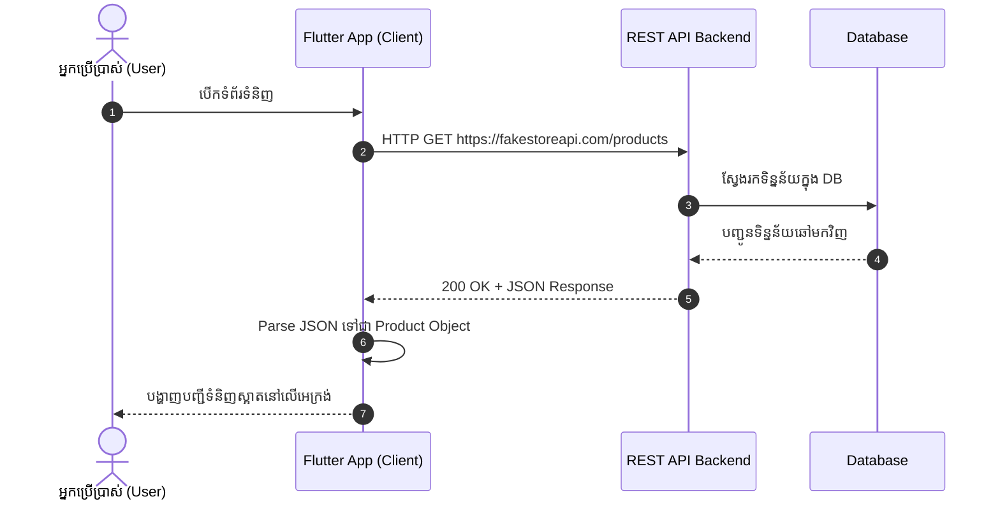

# 🌐 ការប្រើប្រាស់ REST API នៅក្នុង Flutter (Complete Guide)

> ការយល់ដឹងស៊ីជម្រៅអំពី Networking, RESTful Web Services, HTTP Protocol, JSON Serialization, និងការរៀបចំ Architecture សម្រាប់ទាញយក និងបញ្ជូនទិន្នន័យក្នុង Flutter App ប្រកបដោយប្រសិទ្ធភាព និងសុវត្ថិភាព។

---

## 📑 មាតិកា (Table of Contents)

1. [សេចក្តីផ្តើមអំពី REST API (What is REST API?)](#1-សេចក្តីផ្តើមអំពី-rest-api-what-is-rest-api)
   - [Client-Server Architecture](#11-client-server-architecture)
   - [HTTP Methods សំខាន់ៗ (GET, POST, PUT, DELETE)](#12-http-methods-សំខាន់ៗ)
   - [HTTP Status Codes ដែលត្រូវដឹង](#13-http-status-codes-ដែលត្រូវចាំបាច់)
   - [Headers, URL Parameters, និង Request Body](#14-headers-url-parameters-និង-request-body)
2. [ការរៀបចំ Package នៅក្នុង Flutter (Setup)](#2-ការរៀបចំ-package-នៅក្នុង-flutter)
   - [កញ្ចប់ `http` package](#21-ការដំឡើង-http-package)
   - [ការកំណត់ Network Permissions (Android & macOS/iOS)](#22-ការកំណត់-network-permissions)
3. [ដំណើរការ ៤ ជំហាននៃការភ្ជាប់ REST API (The 4 Core Steps)](#3-ដំណើរការ-៤-ជំហាននៃការភ្ជាប់-rest-api)
   - [ជំហានទី ១: បង្កើត Model (JSON Deserialization)](#ជំហានទី-១-បង្កើត-model-json-deserialization)
   - [ជំហានទី ២: បង្កើត API Client / Data Source](#ជំហានទី-២-បង្កើត-api-client--data-source)
   - [ជំហានទី ៣: ភ្ជាប់ជាមួយ Repository & ViewModel](#ជំហានទី-៣-ភ្ជាប់ជាមួយ-repository--viewmodel)
   - [ជំហានទី ៤: បង្ហាញទិន្នន័យលើ UI (Handling Loading/Error/Success)](#ជំហានទី-៤-បង្ហាញទិន្នន័យលើ-ui)
4. [ឧទាហរណ៍ជាក់ស្តែងជាមួយ FakeStore API (Practical Examples)](#4-ឧទាហរណ៍ជាក់ស្តែងជាមួយ-fakestore-api)
   - [ឧទាហរណ៍ទី ១: ទាញយកផលិតផលតែមួយ (Fetch Single Item)](#៤១-ទាញយកផលិតផលតែមួយ-fetch-1-product)
   - [ឧទាហរណ៍ទី ២: ទាញយកបញ្ជីផលិតផលទាំងអស់ (Fetch List of Items)](#៤២-ទាញយកបញ្ជីផលិតផលទាំងអស់-fetch-product-list)
   - [ឧទាហរណ៍ទី ៣: បញ្ជូនទិន្នន័យថ្មី (POST Request)](#៤៣-បញ្ជូនទិន្នន័យថ្មី-post-request)
5. [ការគ្រប់គ្រង Error & ករណីគ្មាន Internet (Error Handling)](#5-ការគ្រប់គ្រង-error--ករណីគ្មាន-internet)
   - [Custom Exception Class](#៥១-បង្កើត-custom-apiexception)
   - [Timeout & Connectivity Fallback](#៥២-handling-timeouts--offline-fallback)
6. [ការរៀបចំតាមស្តង់ដារ MVVM (Clean Data Flow)](#6-ការរៀបចំតាមស្តង់ដារ-mvvm-clean-data-flow)
7. [កំហុសឆ្គងទូទៅ (Common Anti-Patterns)](#7-កំហុសឆ្គងទូទៅ-anti-patterns)
8. [🔍 សំណួរពិភាក្សា និងលំហាត់អនុវត្ត (Quiz & Practice)](#8--សំណួរពិភាក្សា-និងលំហាត់អនុវត្ត-quiz--practice)

---

## 1. សេចក្តីផ្តើមអំពី REST API (What is REST API?)

**REST** តំណាងឱ្យ **REpresentational State Transfer**។ វាគឺជាទម្រង់ស្ថាបត្យកម្មស្តង់ដារ (Architectural Style) សម្រាប់ការបញ្ជូន និងផ្លាស់ប្តូរទិន្នន័យរវាង **Client (Flutter Mobile App)** និង **Server (Backend Database)** តាមរយៈពិធីការ **HTTP/HTTPS**។



---

### 1.1 Client-Server Architecture

- **Client (Frontend/Mobile):** ទទួលខុសត្រូវលើ UI/UX និងទទួលបញ្ជាពី User រួចផ្ញើសំណើ (Request) ទៅកាន់ Server។
- **Server (Backend/API):** ទទួលខុសត្រូវលើ Security, Database Queries, និង Business Logic រួចឆ្លើយតប (Response) ជាទម្រង់ **JSON** (JavaScript Object Notation)។

---

### 1.2 HTTP Methods សំខាន់ៗ

| HTTP Method | សកម្មភាព CRUD | គោលបំណង | ឧទាហរណ៍ URL |
| :--- | :--- | :--- | :--- |
| **`GET`** | **Read** | ទាញយកទិន្នន័យពី Server (មិនកែប្រែទិន្នន័យក្នុង DB) | `GET /products`, `GET /products/1` |
| **`POST`** | **Create** | បង្កើតទិន្នន័យថ្មី ឬ Upload ឯកសារ | `POST /products` (Body: JSON) |
| **`PUT`** | **Update / Replace** | កែប្រែទិន្នន័យទាំងមូលឡើងវិញ | `PUT /products/1` (Body: JSON ពេញលេញ) |
| **`PATCH`** | **Partial Update** | កែប្រែតែផ្នែកខ្លះនៃទិន្នន័យ | `PATCH /products/1` (Body: `{"price": 99.9}`) |
| **`DELETE`** | **Delete** | លុបទិន្នន័យចេញពី Server | `DELETE /products/1` |

---

### 1.3 HTTP Status Codes ដែលត្រូវចាំបាច់

ពេល Server ឆ្លើយតបមកវិញ វាតែងតែភ្ជាប់មកជាមួយ **Status Code** (លេខ ៣ ខ្ទង់) ដើម្បីបញ្ជាក់ថាសំណើជោគជ័យ ឬមានបញ្ហា៖

| លេខកូដ | អត្ថន័យ | ការពន្យល់ |
| :--- | :--- | :--- |
| **`200 OK`** | ជោគជ័យ (Success) | Request បានជោគជ័យ ហើយទិន្នន័យត្រូវបានបញ្ជូនមកវិញ។ |
| **`201 Created`** | បង្កើតជោគជ័យ | ទិន្នន័យថ្មីត្រូវបាន Save ចូលក្នុង Database រួចរាល់ (ជាទូទៅកើតលើ `POST`)។ |
| **`400 Bad Request`** | សំណើមិនត្រឹមត្រូវ | Client ផ្ញើ Body ឬ Parameter ខុសទម្រង់ដែល Server ទាមទារ។ |
| **`401 Unauthorized`** | គ្មានសិទ្ធិ | មិនទាន់ Login ឬ Auth Token ផុតកំណត់ (Expired Token)។ |
| **`403 Forbidden`** | ត្រូវបានហាមឃាត់ | User បាន Login ហើយ តែគ្មានសិទ្ធិចូលមើលទិន្នន័យនោះ (ឧ. User ធម្មតាចង់ចូល Admin)។ |
| **`404 Not Found`** | រកមិនឃើញ | URL endpoint ឬ ID នៃទិន្នន័យមិនមានក្នុង Server។ |
| **`500 Internal Server Error`** | កំហុសខាង Server | Backend Code មាន Bug ឬ Database គាំង។ |

---

### 1.4 Headers, URL Parameters, និង Request Body

1. **URL & Query Parameters:**
   - Base URL: `https://fakestoreapi.com`
   - Path Endpoint: `/products/1` (ទាញយក product id = 1)
   - Query Parameters: `/products?limit=5&sort=desc` (តម្រៀប និងកំណត់ចំនួន)
2. **HTTP Headers:** ព័ត៌មានបន្ថែមអំពីសំណើ ដូចជាប្រភេទនៃទិន្នន័យ ឬ Token សុវត្ថិភាព៖
   ```http
   Content-Type: application/json
   Accept: application/json
   Authorization: Bearer your_jwt_token_here
   ```
3. **Request Body:** ទិន្នន័យដែលផ្ញើទៅកាន់ Server (ជាទូទៅជា JSON string) ពេលប្រើ `POST` ឬ `PUT`។

---

## 2. ការរៀបចំ Package នៅក្នុង Flutter

### 2.1 ការដំឡើង `http` Package

នៅក្នុង `pubspec.yaml`:

```yaml
dependencies:
  flutter:
    sdk: flutter
  http: ^1.6.0 # បណ្ណាល័យផ្លូវការសម្រាប់ធ្វើ HTTP Calls
```

ដំណើរការ command នៅក្នុង Terminal:
```bash
flutter pub get
```

---

### 2.2 ការកំណត់ Network Permissions

> [!IMPORTANT]
> ប្រសិនបើមិនកំណត់ Permission ទេ App នឹងមិនអាចចេញទៅ Internet បានឡើយនៅលើ Platform មួយចំនួន!

#### 🤖 Android (`android/app/src/main/AndroidManifest.xml`)
បន្ថែមបន្ទាត់នេះនៅខាងក្រៅ `<application>` tag:
```xml
<manifest xmlns:android="http://schemas.android.com/apk/res/android">
    <!-- អនុញ្ញាតឱ្យ App ប្រើប្រាស់ Internet -->
    <uses-permission android:name="android.permission.INTERNET"/>
    ...
</manifest>
```

#### 🍏 macOS (`macos/Runner/DebugProfile.entitlements` & `Release.entitlements`)
ប្រសិនបើ Run លើ macOS Desktop ត្រូវបើក network client entitlement:
```xml
<key>com.apple.security.network.client</key>
<true/>
```

---

## 3. ដំណើរការ ៤ ជំហាននៃការភ្ជាប់ REST API

```
┌─────────────────────────────────┐
│ 1. MODEL                        │  បំប្លែង JSON Map <-> Dart Object
└────────────────▲────────────────┘
                 │
┌────────────────┴────────────────┐
│ 2. API CLIENT / SERVICE         │  ហៅ http.get() / decode body
└────────────────▲────────────────┘
                 │
┌────────────────┴────────────────┐
│ 3. REPOSITORY / VIEWMODEL       │  កាន់ State (loading, error, list)
└────────────────▲────────────────┘
                 │
┌────────────────┴────────────────┐
│ 4. VIEW (UI WIDGETS)            │  បង្ហាញ UI តាមរយៈ FutureBuilder ឬ Obx
└─────────────────────────────────┘
```

---

### ជំហានទី ១: បង្កើត Model (JSON Deserialization)

JSON ពី FakeStore API មានទម្រង់បែបនេះ៖
```json
{
  "id": 1,
  "title": "Fjallraven Backpack",
  "price": 109.95,
  "category": "men's clothing",
  "image": "https://fakestoreapi.com/img/81fPKd-2AYL.png"
}
```

យើងត្រូវបង្កើត Dart Class មួយដែលមាន **`factory .fromJson()`** constructor:

```dart
// lib/data/models/product_model.dart
class Product {
  final int id;
  final String title;
  final double price;
  final String category;
  final String image;

  Product({
    required this.id,
    required this.title,
    required this.price,
    required this.category,
    required this.image,
  });

  // 1. Factory Constructor សម្រាប់បំប្លែងពី JSON Map -> Product Object
  factory Product.fromJson(Map<String, dynamic> json) {
    return Product(
      id: (json['id'] as num?)?.toInt() ?? 0,
      title: json['title'] as String? ?? '',
      price: (json['price'] as num?)?.toDouble() ?? 0.0,
      category: json['category'] as String? ?? '',
      image: json['image'] as String? ?? '',
    );
  }

  // 2. Method សម្រាប់បំប្លែងពី Object ត្រឡប់ទៅជា JSON Map វិញ (ប្រើពេល POST/PUT)
  Map<String, dynamic> toJson() {
    return {
      'id': id,
      'title': title,
      'price': price,
      'category': category,
      'image': image,
    };
  }
}
```

---

### ជំហានទី ២: បង្កើត API Client / Data Source

បង្កើត Class មួយដែលទទួលខុសត្រូវតែមួយគត់គឺ **ធ្វើការហៅ Network Call**:

```dart
// lib/data/services/api_client.dart
import 'dart:convert';
import 'package:http/http.dart' as http;
import '../models/product_model.dart';

class ApiClient {
  static const String baseUrl = 'https://fakestoreapi.com';

  /// ហៅទាញយកទំនិញតែមួយតាមរយៈ ID
  Future<Product> getProductById(int id) async {
    final uri = Uri.parse('$baseUrl/products/$id');
    final response = await http.get(uri);

    if (response.statusCode == 200) {
      // jsonDecode បំប្លែងពី String មកជា Map<String, dynamic>
      final Map<String, dynamic> json = jsonDecode(response.body);
      return Product.fromJson(json);
    } else {
      throw Exception('Server Error: ${response.statusCode}');
    }
  }
}
```

---

### ជំហានទី ៣: ភ្ជាប់ជាមួយ Repository & ViewModel

កុំសរសេរ Logic ក្នុង UI! ត្រូវបញ្ជូនបន្តតាមរយៈ Repository និង ViewModel៖

```dart
// lib/data/repositories/product_repository.dart
class ProductRepository {
  final ApiClient _apiClient = ApiClient();

  Future<Product> getProduct(int id) => _apiClient.getProductById(id);
}
```

---

### ជំហានទី ៤: បង្ហាញទិន្នន័យលើ UI

ប្រើប្រាស់ **`FutureBuilder`** (សម្រាប់រៀនដំបូង) ឬ **`GetX / Provider`** ដើម្បី Handle គ្រប់ស្ថានភាពទាំង ៣ (Loading, Error, Success)៖

```dart
FutureBuilder<Product>(
  future: apiService.getProductById(1),
  builder: (context, snapshot) {
    // 1. កំពុងដំណើរការទាញយក (Loading State)
    if (snapshot.connectionState == ConnectionState.waiting) {
      return const Center(child: CircularProgressIndicator());
    }
    // 2. មានបញ្ហា Network ឬ Server (Error State)
    if (snapshot.hasError) {
      return Center(child: Text('កំហុស៖ ${snapshot.error}'));
    }
    // 3. ជោគជ័យ (Success State)
    if (snapshot.hasData) {
      final product = snapshot.data!;
      return Text(product.title);
    }
    return const Center(child: Text('គ្មានទិន្នន័យ'));
  },
)
```

---

## 4. ឧទាហរណ៍ជាក់ស្តែងជាមួយ FakeStore API

### ៤.១ ទាញយកផលិតផលតែមួយ (Fetch 1 Product)

```dart
import 'dart:convert';
import 'package:flutter/material.dart';
import 'package:http/http.dart' as http;

// 1. Function ហៅ 1 URL
Future<Map<String, dynamic>> fetchSingleProduct() async {
  final url = Uri.parse('https://fakestoreapi.com/products/1');
  final response = await http.get(url);

  if (response.statusCode == 200) {
    return jsonDecode(response.body) as Map<String, dynamic>;
  } else {
    throw Exception('Failed to load product. Status: ${response.statusCode}');
  }
}

// 2. Widget បង្ហាញលទ្ធផល
class SingleProductScreen extends StatelessWidget {
  const SingleProductScreen({super.key});

  @override
  Widget build(BuildContext context) {
    return Scaffold(
      appBar: AppBar(title: const Text('Fetch 1 URL Example')),
      body: FutureBuilder<Map<String, dynamic>>(
        future: fetchSingleProduct(),
        builder: (context, snapshot) {
          if (snapshot.connectionState == ConnectionState.waiting) {
            return const Center(child: CircularProgressIndicator());
          }
          if (snapshot.hasError) {
            return Center(child: Text('Error: ${snapshot.error}'));
          }

          final data = snapshot.data!;
          return Padding(
            padding: const EdgeInsets.all(16.0),
            child: Column(
              crossAxisAlignment: CrossAxisAlignment.start,
              children: [
                Center(
                  child: Image.network(data['image'], height: 180),
                ),
                const SizedBox(height: 16),
                Text(
                  data['title'],
                  style: const TextStyle(fontSize: 18, fontWeight: FontWeight.bold),
                ),
                const SizedBox(height: 8),
                Text(
                  '\$${data['price']}',
                  style: const TextStyle(fontSize: 22, color: Colors.green),
                ),
                const SizedBox(height: 8),
                Text(data['description']),
              ],
            ),
          );
        },
      ),
    );
  }
}
```

---

### ៤.២ ទាញយកបញ្ជីផលិតផលទាំងអស់ (Fetch Product List)

ពេល Response ជា List នៃ Objects (`[ {..}, {..}, {..} ]`)៖

```dart
Future<List<Product>> fetchAllProducts() async {
  final url = Uri.parse('https://fakestoreapi.com/products');
  final response = await http.get(url);

  if (response.statusCode == 200) {
    // 1. បំប្លែង string ទៅជា List dynamic
    final List<dynamic> jsonList = jsonDecode(response.body);

    // 2. ប្រើ .map() ដើម្បីបំប្លែង Map នីមួយៗទៅជា Product Object
    return jsonList.map((item) => Product.fromJson(item)).toList();
  } else {
    throw Exception('Failed to load catalog');
  }
}
```

---

### ៤.៣ បញ្ជូនទិន្នន័យថ្មី (POST Request)

នៅពេលចង់ Add ផលិតផលថ្មីទៅ Server យើងប្រើ **`http.post()`** ដោយបញ្ជូន Headers និង Body៖

```dart
Future<Product> createNewProduct({
  required String title,
  required double price,
  required String description,
  required String category,
  required String image,
}) async {
  final url = Uri.parse('https://fakestoreapi.com/products');

  // រៀបចំ payload
  final Map<String, dynamic> bodyData = {
    'title': title,
    'price': price,
    'description': description,
    'category': category,
    'image': image,
  };

  final response = await http.post(
    url,
    headers: {
      'Content-Type': 'application/json', // ត្រូវបញ្ជាក់ប្រាប់ server ថាជា json
    },
    body: jsonEncode(bodyData), // បំប្លែង Map ទៅជា JSON String
  );

  if (response.statusCode == 200 || response.statusCode == 201) {
    final Map<String, dynamic> responseJson = jsonDecode(response.body);
    return Product.fromJson(responseJson);
  } else {
    throw Exception('Failed to create product: ${response.statusCode}');
  }
}
```

---

## 5. ការគ្រប់គ្រង Error & ករណីគ្មាន Internet

### ៥.១ បង្កើត Custom `ApiException`

ដើម្បីងាយស្រួលដឹងថាតើ Error កើតឡើងដោយសារ **Network (គ្មានអ៊ីនធឺណិត)** ឬ **Server Response (404/500)**៖

```dart
class ApiException implements Exception {
  final String message;
  final int? statusCode;

  ApiException(this.message, {this.statusCode});

  @override
  String toString() => statusCode != null 
      ? 'ApiException [$statusCode]: $message' 
      : 'ApiException: $message';
}
```

---

### ៥.២ Handling Timeouts & Offline Fallback

```dart
import 'dart:async';
import 'dart:io';

Future<List<Product>> safeFetchProducts() async {
  try {
    final response = await http
        .get(Uri.parse('https://fakestoreapi.com/products'))
        .timeout(const Duration(seconds: 10)); // កំណត់ Timeout 10s

    if (response.statusCode == 200) {
      final List list = jsonDecode(response.body);
      return list.map((e) => Product.fromJson(e)).toList();
    } else {
      throw ApiException('Server error', statusCode: response.statusCode);
    }
  } on TimeoutException {
    throw ApiException('ការតភ្ជាប់យឺតខ្លាំង (Request Timed out)');
  } on SocketException {
    throw ApiException('គ្មានការតភ្ជាប់អ៊ីនធឺណិតឡើយ (No Internet)');
  } catch (e) {
    throw ApiException('បញ្ហាមិនរំពឹងទុក៖ $e');
  }
}
```

---

## 6. ការរៀបចំតាមស្តង់ដារ MVVM (Clean Data Flow)

នៅក្នុង Project `store_app` យើងបានរៀបចំស្ថាបត្យកម្មតាមលំហូរត្រឹមត្រូវដូចខាងក្រោម៖

```
store_app/
├── lib/
│   ├── data/
│   │   ├── models/
│   │   │   └── product_model.dart      <-- Product Entity & fromJson()
│   │   ├── services/
│   │   │   └── api_client.dart         <-- Live HTTPS Network Calls
│   │   ├── repositories/
│   │   │   └── product_repository.dart <-- Single Source of Truth
│   │   └── fake_store_data.dart        <-- Mock Data (Offline Backup)
│   ├── app/
│   │   ├── view_models/
│   │   │   └── product_view_model.dart <-- State Management (Rx, Loading, List)
│   │   └── views/
│   │       └── home_screen.dart        <-- UI Widgets observing ViewModel
```

> **អត្ថប្រយោជន៍:**
> - UI មិនដែលខ្វល់ថាតើទិន្នន័យបានមកពីណាឡើយ។
> - បើ Server ដាច់ ឬចង់សាកល្បង Mock data យើងគ្រាន់តែកែក្នុង `ProductRepositoryImpl` ដោយមិនប៉ះពាល់ដល់ Widgets មួយបន្ទាត់ណាឡើយ!

---

## 7. កំហុសឆ្គងទូទៅ (Anti-Patterns)

> [!WARNING]
> សូមប្រយ័ត្នចំពោះទម្លាប់មិនល្អទាំងនេះ៖

1. **ហៅ `http.get()` នៅក្នុង `build()` Method:**
   - ❌ *ខុស:* ដាក់ API call ក្នុង `build()` ធ្វើឱ្យ App ហៅ Request ទៅ Server រាប់សិបដងរាល់ពេល Screen Rebuild!
   - ✅ *ត្រូវ:* ហៅក្នុង `initState()`, GetX `onInit()`, ឬ Trigger តាមប៊ូតុង។
2. **មិនពិនិត្យ `statusCode`:**
   - ❌ *ខុស:* ធ្វើ `jsonDecode(response.body)` ភ្លាមៗដោយមិនខ្វល់ថា Response ជា 200 ឬ 404/500។
   - ✅ *ត្រូវ:* ឆែក `if (response.statusCode == 200)` សិន។
3. **Hardcode URL នៅរាយប៉ាយគ្រប់ទីកន្លែង:**
   - ❌ *ខុស:* សរសេរ `https://fakestoreapi.com/products` នៅគ្រប់ Widget។
   - ✅ *ត្រូវ:* ប្រមូលផ្តុំក្នុង `ApiClient` ឬ `AppConstants.baseUrl`។
4. **មិន Catch Exception ពេលគ្មាន Internet:**
   - ❌ *ខុស:* បណ្តោយឱ្យ App គាំង (Crash / Red Screen) ពេលបិទ Wi-Fi/Cellular។
   - ✅ *ត្រូវ:* ប្រើ `try-catch` និងបង្ហាញ UI សមរម្យ (ឧ. "សូមពិនិត្យមើលប្រព័ន្ធអ៊ីនធឺណិត")។

---