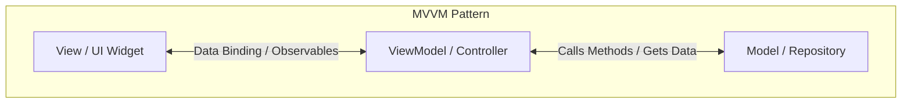
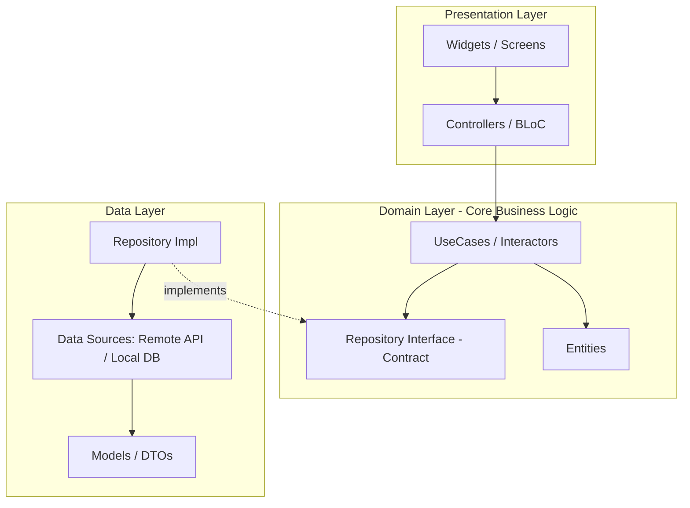

# 🏛️ Architecture & Design Patterns នៅក្នុង Flutter

> ការយល់ដឹងស៊ីជម្រៅអំពីស្ថាបត្យកម្មកម្មវិធី (Software Architecture) និងទម្រង់នៃការរចនាកូដ (Design Patterns) ដើម្បីកសាង Flutter App ឱ្យមាន **Scalability**, **Testability**, និង **Maintainability** កម្រិតខ្ពស់។

---

## 📑 មាតិកា (Table of Contents)

1. [សេចក្តីផ្តើមអំពី Architecture និង Design Patterns](#1-សេចក្តីផ្តើម-why-architecture-matters)
2. [ស្ថាបត្យកម្មស្នូលក្នុង Flutter (Core Architectural Patterns)](#2-ស្ថាបត្យកម្មស្នូលក្នុង-flutter-core-architectural-patterns)
   - [MVVM (Model - View - ViewModel)](#21-mvvm-model---view---viewmodel)
   - [Clean Architecture](#22-clean-architecture-by-uncle-bob)
   - [BLoC (Business Logic Component) Pattern](#23-bloc-pattern)
   - [ការប្រៀបធៀប MVC vs MVVM vs BLoC](#24-ការប្រៀបធៀប-mvc-vs-mvvm-vs-bloc)
3. [Design Patterns សំខាន់ៗដែលនិយមប្រើបំផុតក្នុង Flutter](#3-design-patterns-សំខាន់ៗដែលនិយមប្រើក្នុង-flutter)
   - [Repository Pattern](#31-repository-pattern)
   - [Singleton Pattern](#32-singleton-pattern)
   - [Factory Pattern (Factory Constructors)](#33-factory-pattern)
   - [Dependency Injection & Service Locator Pattern](#34-dependency-injection-di--service-locator)
   - [Observer / Reactive Pattern](#35-observer--reactive-pattern)
   - [Builder Pattern](#36-builder-pattern)
4. [រចនាសម្ព័ន្ធថតឯកសារគម្រោង (Project Folder Structure)](#4-រចនាសម្ព័ន្ធថតឯកសារគម្រោង-project-folder-structure)
   - [Layer-First Approach](#41-layer-first-approach-សមស្របសម្រាប់-small-to-medium-apps)
   - [Feature-First Approach](#42-feature-first-approach-សមស្របសម្រាប់-medium-to-large-apps)
5. [ការអនុវត្តជាក់ស្តែង៖ MVVM + Repository Pattern](#5-ការអនុវត្តជាក់ស្តែង-mvvm--repository-pattern-step-by-step)
6. [គោលការណ៍ SOLID នៅក្នុង Flutter](#6-គោលការណ៍-solid-principles-នៅក្នុង-flutter)
7. [កំហុសឆ្គងទូទៅ (Anti-Patterns) ដែលគួរជៀសវាង](#7-កំហុសឆ្គងទូទៅ-anti-patterns-ដែលគួរជៀសវាង)
8. [🔍 សំណួរពិភាក្សា និងលំហាត់អនុវត្ត (Quiz & Practice)](#8--សំណួរពិភាក្សា-និងលំហាត់អនុវត្ត-quiz--practice)

---

## 1. សេចក្តីផ្តើម (Why Architecture Matters?)

នៅក្នុង Flutter អ្វីៗគ្រប់យ៉ាងគឺជា **Widget** ហើយ UI ត្រូវបានបង្កើតឡើងតាមរយៈរូបមន្ត Reactive៖

$$\text{UI} = f(\text{State})$$

នៅពេលដែល App នៅតូច (Small scale) ការសរសេរបញ្ចូលគ្នារវាង UI, API Call, និង Business Logic នៅក្នុង `StatefulWidget` តែមួយ អាចដំណើរការបាន។ ប៉ុន្តែនៅពេលដែល App កាន់តែធំឡើង ការមិនបែងចែក Architecture នឹងបង្កជាបញ្ហា **Spaghetti Code**:
- កូដពិបាកកែសម្រួល (Hard to maintain)
- ពិបាកធ្វើតេស្តស្វ័យប្រវត្តិ (Impossible to Unit Test)
- ពិបាកសហការគ្នាជាក្រុម (Merge conflicts ញឹកញាប់)
- ពិបាកបន្ថែមមុខងារថ្មី (Low scalability)

### 🎯 គោលបំណងសំខាន់នៃ Architecture:
1. **Separation of Concerns (SoC):** បំបែកកាតព្វកិច្ចច្បាស់លាស់រវាង UI (Presentation), ដំណើរការទិន្នន័យ (Business Logic), និងប្រភពទិន្នន័យ (Data Sources)។
2. **Testability:** អនុញ្ញាតឱ្យយើងសរសេរ Unit Test លើ Logic បានដោយមិនចាំបាច់ដំណើរការ UI ឬ Network ពិតប្រាកដ។
3. **Reusability:** Data Repository ឬ ViewModel មួយ អាចប្រើឡើងវិញលើ Screens ច្រើនផ្សេងគ្នា។
4. **Maintainability:** ពេលមាន Bug ឬចង់ផ្លាស់ប្តូរ API/Database យើងកែប្រែតែ Layer ទិន្នន័យប៉ុណ្ណោះ ដោយមិនប៉ះពាល់ដល់ UI។

---

## 2. ស្ថាបត្យកម្មស្នូលក្នុង Flutter (Core Architectural Patterns)



---

### 2.1 MVVM (Model - View - ViewModel)

**MVVM** គឺជា Pattern ដែលពេញនិយមបំផុតក្នុង Flutter (ជាពិសេសជាមួយ **GetX**, **Provider**, ឬ **Riverpod**) ព្រោះវាស៊ីគ្នាឥតខ្ចោះជាមួយ Declarative UI របស់ Flutter។

```
┌─────────────────┐        User Actions        ┌───────────────────────┐
│                 │ ─────────────────────────> │                       │
│      VIEW       │                            │       VIEWMODEL       │
│  (UI / Widgets) │ <───────────────────────── │ (State & Logic/Getx)  │
└─────────────────┘      Data / State Stream   └───────────────────────┘
                                                           │   ▲
                                                 Fetch/Save│   │ Data
                                                           ▼   │
                                               ┌───────────────────────┐
                                               │         MODEL         │
                                               │ (Entities/Repository) │
                                               └───────────────────────┘
```

#### តួនាទីនៃធាតុទាំង ៣៖
- **View (UI Layer):** 
  - ទទួលខុសត្រូវតែលើការបង្ហាញរូបរាង UI និងទទួល Action ពី User (ចុចប៊ូតុង, Scroll, វាយអក្សរ)។
  - **ដាច់ខាតមិនត្រូវមាន Business Logic ឬហៅ API ដោយផ្ទាល់ឡើយ!**
  - ស្តាប់ State ពី ViewModel ដើម្បីគូរ UI ឡើងវិញ (ឧ. ប្រើ `Obx()`, `Consumer()`, ឬ `BlocBuilder()`)។
- **ViewModel (Presentation Logic Layer):**
  - កាន់ State (ដូចជា `isLoading`, `productList`, `errorMessage`)។
  - បំប្លែងទិន្នន័យពី Model ឱ្យស្របតាមតម្រូវការ UI (ឧ. Format កាលបរិច្ឆេទ ឬតម្លៃរូបិយប័ណ្ណ)។
  - ទទួល Event ពី View រួចបញ្ជូនទៅហៅ Repository។
- **Model (Data Layer):**
  - កំណត់ទម្រង់ទិន្នន័យ (Data Classes / Entities) ដូចជា `Product`, `User`។
  - គ្រប់គ្រង Logic នៃការទាញយកទិន្នន័យ (ពី API, Local SQLite, Firebase)។

---

### 2.2 Clean Architecture (by Uncle Bob)

សម្រាប់គម្រោងធំៗកម្រិត Enterprise, **Clean Architecture** គឺជាជម្រើសស្តង់ដារដែលធានាភាពឯករាជ្យរវាង Layer នីមួយៗតាមរយៈ **Dependency Inversion**។



#### ស្រទាប់ទាំង ៣ (3 Main Layers):
1. **Domain Layer (ស្នូលកណ្តាល - ឯករាជ្យបំផុត):**
   - **Entities:** Business Object សុទ្ធសាធ គ្មាន Dependency ជាមួយ Framework ឬ Library ណាទាំងអស់។
   - **Use Cases:** សកម្មភាពជាក់លាក់នៃ Business (ឧ. `GetProductsUseCase`, `LoginUserUseCase`)។
   - **Repository Interfaces:** កិច្ចសន្យា (Contract/Abstract class) កំណត់ថាត្រូវធ្វើអ្វី ប៉ុន្តែមិនខ្វល់ពីរបៀបធ្វើឡើយ។
2. **Data Layer (អ្នកអនុវត្តទិន្នន័យ):**
   - **Data Sources:** ផ្នែកទាក់ទងផ្ទាល់ជាមួយ network (`Dio`, `Http`) ឬ local cache (`Hive`, `SharedPreferences`)។
   - **Models:** Subclass ឬ DTO របស់ Entity ដែលមាន `.fromJson()` និង `.toJson()`។
   - **Repository Implementation:** អនុវត្តកិច្ចសន្យាពី Domain Layer ដោយសម្រេចចិត្តថាត្រូវទាញពី Cache ឬ Network។
3. **Presentation Layer (ការបង្ហាញ):**
   - **UI / Screens:** អេក្រង់ Flutter Widgets។
   - **State Holders:** Controllers/BLoC ដែលហៅ Use Cases រួចផ្លាស់ប្តូរ State។

---

### 2.3 BLoC Pattern (Business Logic Component)

បង្កើតឡើងដោយវិស្វករ Google ដើម្បីគ្រប់គ្រង State តាមរយៈ **Streams** និង **Reactive Programming**។

```
     UI (Widgets)
     │          ▲
     │ Events   │ States
     ▼          │
 ┌─────────────────┐
 │      BLoC       │
 └─────────────────┘
```

- **Event:** សកម្មភាពដែលកើតចេញពី UI (ឧ. `FetchProductsEvent`, `AddToCartEvent`)។
- **State:** ស្ថានភាពដែល BLoC បញ្ចេញទៅ UI (ឧ. `ProductLoadingState`, `ProductLoadedState`, `ProductErrorState`)។
- **BLoC:** ទទួល Event $\rightarrow$ ដំណើរការ Logic $\rightarrow$ បញ្ចេញ State ថ្មី។

---

### 2.4 ការប្រៀបធៀប MVC vs MVVM vs BLoC

| លក្ខណៈវិនិច្ឆ័យ | MVC | MVVM | BLoC |
| :--- | :--- | :--- | :--- |
| **Coupling (ភាពជាប់ជំពាក់)** | មធ្យម (Controller ច្រើនតែជាប់ជាមួយ View) | ទាប (View ស្តាប់ ViewModel តាម Reactive) | ទាបបំផុត (ទាក់ទងគ្នាតាម Event និង State) |
| **Boilerplate Code** | តិច | មធ្យម | ច្រើន (ត្រូវការ Events, States, BLoC) |
| **Testability** | លំបាកល្មម | ងាយស្រួលខ្លាំង | ងាយស្រួលខ្លាំងបំផុត (Stream Testing) |
| **Learning Curve** | ងាយស្រួល | មធ្យម | ខ្ពស់ (ទាមទារយល់ដឹង Streams & Reactive) |
| **ទំហំគម្រោងស័ក្តិសម** | តូច (Small) | មធ្យម ទៅ ធំ (Medium - Large) | ធំខ្លាំង (Enterprise Scale) |

---

## 3. Design Patterns សំខាន់ៗដែលនិយមប្រើក្នុង Flutter

### 3.1 Repository Pattern

**Repository Pattern** ដើរតួជាអ្នកកណ្តាលរវាង Business Logic និងប្រភពទិន្នន័យជាក់ស្តែង (Data Sources)។ គោលបំណងគឺដើម្បីលាក់បាំងប្រភពដើមនៃទិន្នន័យពី UI និង ViewModel។

```
┌────────────────┐          ┌───────────────────────┐          ┌──────────────────────┐
│                │  Calls   │                       │  Remote  │   Remote Data Source │
│   ViewModel    │ ───────> │  ProductRepository    │ ───────> │     (REST API)       │
│                │          │  (Abstraction & Cache)│          └──────────────────────┘
└────────────────┘          └───────────────────────┘          ┌──────────────────────┐
                                                       │ Local │   Local Data Source  │
                                                       └─────> │    (SQLite / Hive)   │
                                                               └──────────────────────┘
```

#### ឧទាហរណ៍ជាក់ស្តែង (Implementation):

```dart
// 1. Contract / Interface
abstract class ProductRepository {
  Future<List<Product>> getProducts();
  Future<Product?> getProductById(int id);
}

// 2. Concrete Implementation
class ProductRepositoryImpl implements ProductRepository {
  final ApiService _apiService;
  final LocalStorage _localStorage;

  ProductRepositoryImpl({
    required ApiService apiService,
    required LocalStorage localStorage,
  })  : _apiService = apiService,
        _localStorage = localStorage;

  @override
  Future<List<Product>> getProducts() async {
    try {
      // ប្រសិនបើមានអ៊ីនធឺណិត ទាញពី API រួច Cache ទុក
      final rawData = await _apiService.fetchProducts();
      final products = rawData.map((e) => Product.fromJson(e)).toList();
      await _localStorage.cacheProducts(products);
      return products;
    } catch (_) {
      // បើគ្មានអ៊ីនធឺណិត ទាញពី Local Cache មកបង្ហាញ
      return await _localStorage.getCachedProducts();
    }
  }

  @override
  Future<Product?> getProductById(int id) async {
    return await _apiService.fetchProductDetails(id);
  }
}
```

> **💡 អត្ថប្រយោជន៍:**
> - បើថ្ងៃក្រោយប្តូរពី REST API ទៅ GraphQL ឬ Firebase យើងគ្រាន់តែបង្កើត Implementation ថ្មី ដោយមិនបាច់ប៉ះកូដ UI ឬ ViewModel ឡើយ។
> - ងាយស្រួលសរសេរ `MockProductRepository` ពេលធ្វើ Unit Test។

---

### 3.2 Singleton Pattern

ប្រើប្រាស់នៅពេលដែលយើងចង់ឱ្យ Class មួយមាន **Instance តែមួយគត់ (Single Instance)** ទូទាំងកម្មវិធី ដូចជា Network Client, Local Storage, ឬ Analytics Service។

```dart
class AppConfig {
  // Private constructor ការពារកុំឱ្យគេប្រើ `AppConfig()` ពីក្រៅ
  AppConfig._internal();

  // Static field ផ្ទុក instance តែមួយគត់
  static final AppConfig instance = AppConfig._internal();

  // Properties
  String apiBaseUrl = "https://api.example.com";
  bool isProduction = false;
}

// របៀបប្រើប្រាស់៖
void main() {
  AppConfig.instance.apiBaseUrl = "https://production.example.com";
  print(AppConfig.instance.apiBaseUrl);
}
```

---

### 3.3 Factory Pattern

Flutter ប្រើប្រាស់ **Factory Constructor** យ៉ាងច្រើនដើម្បីបង្កើត Object តាមលក្ខខណ្ឌ ឬបំប្លែងទិន្នន័យ (Deserialization)។

```dart
class Product {
  final int id;
  final String title;
  final double price;

  Product({required this.id, required this.title, required this.price});

  // Factory constructor សម្រាប់បំប្លែងពី JSON Map មកជា Object
  factory Product.fromJson(Map<String, dynamic> json) {
    return Product(
      id: json['id'] as int,
      title: json['title'] as String? ?? 'Unknown',
      price: (json['price'] as num).toDouble(),
    );
  }
}
```

---

### 3.4 Dependency Injection (DI) & Service Locator

ការចៀសវាងការបង្កើត Object ដោយផ្ទាល់ (`new Class()`) នៅក្នុង Class ផ្សេងទៀត ដើម្បីកាត់បន្ថយ Coupling។ នៅក្នុង Flutter យើងនិយមប្រើ **GetX Dependency Management** ឬ **get_it**។

#### ការប្រើជាមួយ GetX:
```dart
// 1. ចុះឈ្មោះ Dependency នៅពេល App ចាប់ផ្តើម
void setupDependencies() {
  // ចុះឈ្មោះ Repository
  Get.lazyPut<ProductRepository>(() => ProductRepositoryImpl());

  // ចុះឈ្មោះ ViewModel ដោយ Inject Repository ចូល
  Get.lazyPut<ProductViewModel>(
    () => ProductViewModel(repository: Get.find<ProductRepository>()),
  );
}

// 2. ហៅប្រើនៅក្នុង View
class ProductCatalogView extends StatelessWidget {
  @override
  Widget build(BuildContext context) {
    // ស្វែងរក ViewModel ដែលបានចុះឈ្មោះ
    final viewModel = Get.find<ProductViewModel>();
    return Scaffold(...);
  }
}
```

---

### 3.5 Observer / Reactive Pattern

UI ធ្វើការជា **Observer** ដែលចាំតាមដានការប្រែប្រួលនៃ State (Subject/Observable)។ ពេល State ផ្លាស់ប្តូរ UI នឹង Render ឡើងវិញដោយស្វ័យប្រវត្តិ។

```dart
// Subject (Observable)
final RxInt counter = 0.obs;

// Observer (Widget)
Obx(() => Text("តម្លៃបច្ចុប្បន្ន: ${counter.value}"));
```

---

### 3.6 Builder Pattern

Flutter Framework ខ្លួនឯងពឹងផ្អែកលើ Builder Pattern ស្ទើរតែទាំងស្រុង៖
- `ListView.builder`: សាងសង់ Widget Item តាមតម្រូវការជាក់ស្តែង (On-demand creation) ដើម្បីសន្សំសំចៃ Memory។
- `FutureBuilder` / `StreamBuilder`: សាងសង់ UI ដោយផ្អែកលើស្ថានភាព Async (Loading, Success, Error)។

---

## 4. រចនាសម្ព័ន្ធថតឯកសារគម្រោង (Project Folder Structure)

ការរៀបចំ Structure ឱ្យមានរបៀប ជួយឱ្យ Developer ងាយស្រួលរកកូដ និងធ្វើការជាក្រុម។

### 4.1 Layer-First Approach (សមស្របសម្រាប់ Small to Medium Apps)

រៀបចំចែកតាមប្រភេទនៃកូដ (Data, Domain, Presentation)៖

```
lib/
├── app/
│   ├── view_models/           # Logic & State (GetxControllers / ViewModels)
│   │   ├── product_view_model.dart
│   │   └── cart_view_model.dart
│   └── views/                 # UI Screens & Pages
│       ├── catalog_view.dart
│       ├── detail_view.dart
│       └── cart_view.dart
├── data/
│   ├── models/                # Data Classes & JSON Parsing
│   │   └── product_model.dart
│   ├── repositories/          # Repositories & Implementations
│   │   └── product_repository.dart
│   └── data_sources/          # API Clients, Database Handlers
│       ├── api_client.dart
│       └── fake_store_data.dart
├── core/
│   ├── constants/             # App Colors, Strings, Asset Paths
│   ├── theme/                 # App Themes (Light/Dark)
│   └── utils/                 # Helpers, Extensions, Formatters
├── widgets/                   # Reusable Common Widgets
│   ├── custom_button.dart
│   └── loading_indicator.dart
└── main.dart
```

---

### 4.2 Feature-First Approach (សមស្របសម្រាប់ Medium to Large Apps)

រៀបចំចែកតាម **មុខងារ (Feature)** នីមួយៗដាច់ដោយឡែកពីគ្នា៖

```
lib/
├── features/
│   ├── authentication/
│   │   ├── data/
│   │   ├── domain/
│   │   └── presentation/
│   ├── products/
│   │   ├── data/
│   │   │   ├── models/product_model.dart
│   │   │   └── repositories/product_repository_impl.dart
│   │   ├── domain/
│   │   │   └── repositories/product_repository.dart
│   │   └── presentation/
│   │       ├── controllers/product_controller.dart
│   │       ├── screens/product_list_screen.dart
│   │       └── widgets/product_card.dart
│   └── cart/
│       ├── data/
│       └── presentation/
├── core/                      # Global items shared across all features
└── main.dart
```

---

## 5. ការអនុវត្តជាក់ស្តែង: MVVM + Repository Pattern (Step-by-Step)

តោះអនុវត្តជាក់ស្តែងនូវ Pattern **MVVM + Repository** ដូចដែលមានក្នុងគម្រោង `store_app`:

### ជំហានទី ១: បង្កើត Model (Data Entity)

```dart
// lib/data/models/product_model.dart
class Product {
  final int id;
  final String title;
  final double price;
  final String category;
  final String imageUrl;

  Product({
    required this.id,
    required this.title,
    required this.price,
    required this.category,
    required this.imageUrl,
  });

  factory Product.fromJson(Map<String, dynamic> json) {
    return Product(
      id: json['id'] as int,
      title: json['title'] as String,
      price: (json['price'] as num).toDouble(),
      category: json['category'] as String,
      imageUrl: json['imageUrl'] as String,
    );
  }
}
```

---

### ជំហានទី ២: បង្កើត Repository Contract & Implementation

```dart
// lib/data/repositories/product_repository.dart
abstract class ProductRepository {
  Future<List<Product>> getProducts();
  Future<List<Product>> getProductsByCategory(String category);
}

class ProductRepositoryImpl implements ProductRepository {
  @override
  Future<List<Product>> getProducts() async {
    // ក្លែងធ្វើ Network Delay 1 វិនាទី
    await Future.delayed(const Duration(seconds: 1));
    return mockProducts; // ទាញពី API ឬ Mock Data
  }

  @override
  Future<List<Product>> getProductsByCategory(String category) async {
    await Future.delayed(const Duration(milliseconds: 500));
    if (category.toLowerCase() == 'all') return mockProducts;
    return mockProducts.where((p) => p.category == category).toList();
  }
}
```

---

### ជំហានទី ៣: បង្កើត ViewModel (GetX Controller)

```dart
// lib/app/view_models/product_view_model.dart
import 'package:get/get.dart';
import '../../data/models/product_model.dart';
import '../../data/repositories/product_repository.dart';

class ProductViewModel extends GetxController {
  final ProductRepository _repository;

  // Constructor Injection: អនុញ្ញាតឱ្យយើង Pass Mock Repo ពេល Test
  ProductViewModel({ProductRepository? repository})
      : _repository = repository ?? ProductRepositoryImpl();

  // Observable States (State ដែល View អាចស្តាប់បាន)
  final RxList<Product> products = <Product>[].obs;
  final RxBool isLoading = false.obs;
  final RxString errorMessage = ''.obs;

  @override
  void onInit() {
    super.onInit();
    fetchProducts();
  }

  Future<void> fetchProducts() async {
    try {
      isLoading.value = true;
      errorMessage.value = '';
      
      final result = await _repository.getProducts();
      products.assignAll(result);
    } catch (e) {
      errorMessage.value = 'មិនអាចទាញទិន្នន័យបាន: $e';
    } finally {
      isLoading.value = false;
    }
  }
}
```

---

### ជំហានទី ៤: បង្កើត View (UI Layer)

```dart
// lib/app/views/product_catalog_view.dart
import 'package:flutter/material.dart';
import 'package:get/get.dart';
import '../view_models/product_view_model.dart';

class ProductCatalogView extends StatelessWidget {
  const ProductCatalogView({Key? key}) : super(key: key);

  @override
  Widget build(BuildContext context) {
    // Inject ឬស្វែងរក ViewModel
    final vm = Get.put(ProductViewModel());

    return Scaffold(
      appBar: AppBar(
        title: const Text('បញ្ជីផលិតផល (MVVM)'),
        actions: [
          IconButton(
            icon: const Icon(Icons.refresh),
            onPressed: vm.fetchProducts,
          ),
        ],
      ),
      body: Obx(() {
        // 1. State: កំពុង Loading
        if (vm.isLoading.value) {
          return const Center(child: CircularProgressIndicator());
        }

        // 2. State: មានបញ្ហា Error
        if (vm.errorMessage.isNotEmpty) {
          return Center(
            child: Text(
              vm.errorMessage.value,
              style: const TextStyle(color: Colors.red),
            ),
          );
        }

        // 3. State: ទិន្នន័យទទេ
        if (vm.products.isEmpty) {
          return const Center(child: Text('ពុំមានទំនិញឡើយ'));
        }

        // 4. State: Success - បង្ហាញ UI
        return ListView.builder(
          itemCount: vm.products.length,
          itemBuilder: (context, index) {
            final product = vm.products[index];
            return ListTile(
              leading: Image.network(
                product.imageUrl,
                width: 50,
                errorBuilder: (_, __, ___) => const Icon(Icons.image),
              ),
              title: Text(product.title),
              subtitle: Text('\$${product.price.toStringAsFixed(2)}'),
            );
          },
        );
      }),
    );
  }
}
```

---

## 6. គោលការណ៍ SOLID នៅក្នុង Flutter

| គោលការណ៍ | ឈ្មោះពេញ | ការអនុវត្តក្នុង Flutter |
| :--- | :--- | :--- |
| **S** | **Single Responsibility Principle** | Widget មួយគួរតែមានភារកិច្ចតែមួយ (កុំដាក់ UI, Validation, និង API ចូលគ្នាក្នុង Widget តែមួយ)។ |
| **O** | **Open/Closed Principle** | Class គួរតែបើកចំហសម្រាប់ការបន្ថែម (Extension) តែបិទជិតសម្រាប់ការកែប្រែ (Modification)។ |
| **L** | **Liskov Substitution Principle** | Subclass ត្រូវតែអាចជំនួស Base Class បានដោយមិនធ្វើឱ្យ App ដំណើរការខុសប្រក្រតី (ឧ. `MockRepository` ជំនួស `RepositoryImpl`)។ |
| **I** | **Interface Segregation Principle** | កុំបង្កើត Interface ធំពេកដែលបង្ខំឱ្យ Class អនុវត្ត Methods ដែលវាមិនត្រូវការ។ បំបែក Interface ឱ្យតូចៗល្មម។ |
| **D** | **Dependency Inversion Principle** | High-level module មិនគួរពឹងផ្អែកលើ Low-level module ទេ ប៉ុន្តែទាំងពីរគួរពឹងផ្អែកលើ Abstraction (Interfaces)។ |

---

## 7. កំហុសឆ្គងទូទៅ (Anti-Patterns) ដែលគួរជៀសវាង

> [!WARNING]
> សូមប្រុងប្រយ័ត្នចំពោះកំហុសទូទៅទាំងនេះ ដើម្បីធានាគុណភាពកូដ៖

1. **ហៅ API ឬទាញទិន្នន័យនៅក្នុង `build()` Method:**
   - ❌ *ខុស:* ដាក់ `http.get()` នៅក្នុង `Widget build(...)` (វានឹងហៅម្ដងហើយម្ដងទៀតរាល់ពេល UI Rebuild)។
   - ✅ *ត្រូវ:* ហៅវានៅក្នុង `initState()`, Controller `onInit()`, ឬ Trigger តាមប៊ូតុង។
2. **បញ្ជូន `BuildContext` ចូលទៅកាន់ ViewModel ឬ Data Layer:**
   - ❌ *ខុស:* បញ្ជូន `context` ទៅ ViewModel ដើម្បីបើក Dialog ឬ Snackbar។
   - ✅ *ត្រូវ:* ទុក `BuildContext` ឱ្យនៅតែក្នុង View Layer ប៉ុណ្ណោះ។
3. **Monolithic Fat Widgets:**
   - ❌ *ខុស:* សរសេរកូដ 1000+ បន្ទាត់ក្នុង file តែមួយដោយមិនបំបែក Widget តូចៗ។
   - ✅ *ត្រូវ:* បំបែកជា Widget តូចៗ (Extract Sub-widgets)។
4. **មិនដោះស្រាយ Exception / Error States:**
   - ❌ *ខុស:* សន្មតថា API Call ជោគជ័យជានិច្ច (`await api.get()`)។
   - ✅ *ត្រូវ:* ប្រើ `try-catch` និងបង្ហាញ State Error ជាក់លាក់ទៅកាន់ User។

---

## 8. 🔍 សំណួរពិភាក្សា និងលំហាត់អនុវត្ត (Quiz & Practice)

### ❓ សំណួរពិភាក្សា (Discussion Questions)
1. **ហេតុអ្វីបានជាគេមិនឱ្យសរសេរ Logic ហៅ Network API ដោយផ្ទាល់នៅក្នុង `Widget`?**
2. **តើ `Abstract Class` ជួយអ្វីខ្លះដល់ការបង្កើត Repository Pattern និងការសរសេរ Unit Test?**
3. **រវាង `Layer-First` និង `Feature-First` តើគម្រោងបែបណាខ្លះដែលគួរជ្រើសរើសមួយណា? ព្រោះអ្វី?**
4. **តើ `Dependency Inversion Principle (DIP)` ត្រូវបានឆ្លុះបញ្ចាំងយ៉ាងដូចម្តេចតាមរយៈការប្រើប្រាស់ Interface និង GetX/Provider?**

---

### 🛠️ លំហាត់អនុវត្តជាក់ស្តែង (Hands-on Challenge)

**លំហាត់:** អនុវត្តបង្កើត **MVVM + Repository Pattern** សម្រាប់មុខងារ **User Profile**:
1. បង្កើត `UserModel` (មាន `id`, `name`, `email`, `avatarUrl`)។
2. បង្កើត `UserRepository` (Abstract) និង `UserRepositoryImpl` ដែលទាញទិន្នន័យក្លែងក្លាយ (Mock data) ដោយមាន Delay 1.5 វិនាទី។
3. បង្កើត `UserViewModel` គ្រប់គ្រង State: `user`, `isLoading`, `errorMessage` និង Method `loadUserProfile()`។
4. បង្កើត `UserProfileScreen` ដោយប្រើ `Obx()` ដើម្បីបង្ហាញ Loading Indicator, បង្ហាញ Error បើមានបញ្ហា, និងបង្ហាញ Profile Card ពេលជោគជ័យ!
