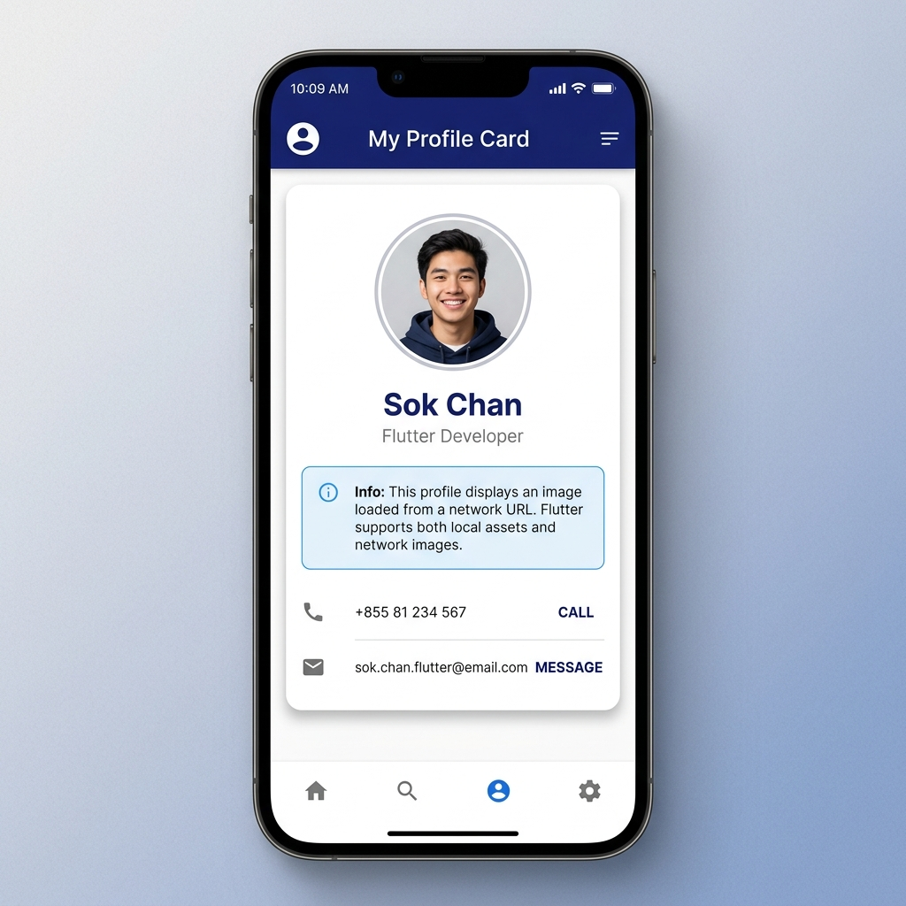
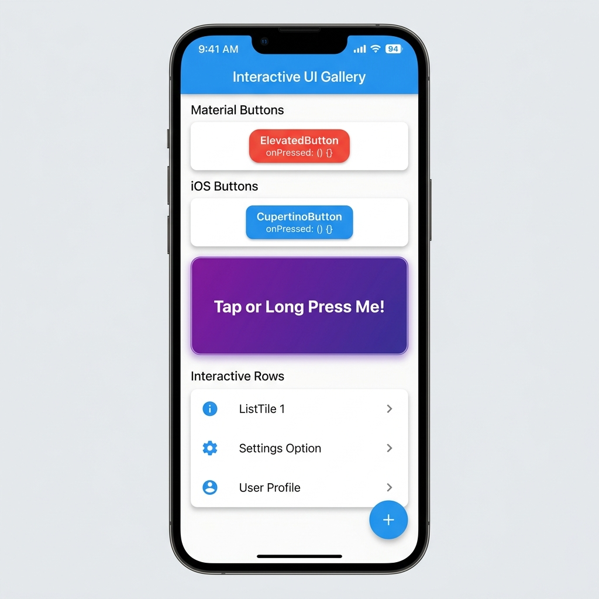

## 📝 លំហាត់អនុវត្ត (Practice Tasks)

### 📌 លំហាត់ទី ១: បង្កើត Profile Card តាំងបង្ហាញព័ត៌មានផ្ទាល់ខ្លួន (Basic Widgets Focus)

**គំរូលទ្ធផលរំពឹងទុក (Expected UI Result):**

```
```



**តម្រូវការ:**

1. ប្រើប្រាស់ `Scaffold` និង `AppBar` ដាក់ចំណងជើងថា `"My Profile Card"`។
2. ប្រើប្រាស់ `Card` នៅចំកណ្តាលអេក្រង់ ដោយមាន `Padding` 20px។
3. នៅក្នុង Card ត្រូវមាន៖
   - រូបភាព Profile ដោយប្រើប្រាស់ `Image.network` (ឬ `Image.asset`) មានកាំជ្រុងមូល ឬដាក់ក្នុង `Container` (មាន `BorderRadius`)។
   - ឈ្មោះរបស់អ្នក (ប្រើ `Text` មាន font ធំ និង bold)។
   - ជំនាញ ឬ មុខតំណែង (ប្រើ `Text` ពណ៌ប្រផេះ)។
   - `SizedBox` សម្រាប់ឃ្លាតចន្លោះពីធាតុមួយទៅធាតុមួយ។
   - បង្ហាញព័ត៌មានទំនាក់ទំនង (លេខទូរស័ព្ទ, អ៊ីមែល) ដោយប្រើ `ListTile` ឬ `Row` ជាមួយ `Icon`។

---

### 📌 លំហាត់ទី ២: ការបង្កើត Interactive Action Buttons (Interactivity Focus)

**គំរូលទ្ធផលរំពឹងទុក (Expected UI Result):**



**តម្រូវការ:**

1. បង្កើតសកម្មភាពចុចនៅលើ Buttons ផ្សេងៗគ្នា៖
   - **ElevatedButton**: ចុចហើយបង្ហាញ `SnackBar` ឬ Print សារកម្រិតខ្ពស់។
   - **TextButton**: ចុចដើម្បី Reset ឬ បោះបង់។
   - **IconButton**: ប៊ូតុង Like (Icon បេះដូង) ឬ Favorite។
   - **CupertinoButton**: បង្កើតប៊ូតុងរចនាប័ទ្ម iOS ពណ៌ខៀវ មានអត្ថបទ `"iOS Action"`។
   - **FloatingActionButton**: ដាក់នៅបាតអេក្រង់ Scaffold ពេលចុចឱ្យវាបង្ហាញ Message។
2. ប្រើប្រាស់ `GestureDetector` រុំលើ `Container` មួយ (ដែលមានពណ៌ និងជ្រុងមូល) ដើម្បីបង្កើត Custom Button ដោយខ្លួនឯង៖
   - ពេល `onTap` -> ឱ្យបង្ហាញសារ ឬប្តូរ trạng thái/print log។
   - ពេល `onLongPress` -> ឱ្យ print សារ `"Long Pressed!"`។

---

## 🔍 សំណួរពិភាក្សា និងការរំលឹកសាល្បង (Quiz / Discussion)

1. តើ **Image.asset** និង **Image.network** មានលក្ខណៈខុសគ្នាយ៉ាងដូចម្តេច? ហើយតើពេលណាដែលយើងគួរប្រើប្រាស់មួយណា?
2. ហេតុអ្វីបានជាគេប្រើប្រាស់ **SizedBox** ជំនួស **Padding** ឬ **Container** ក្នុងករណីខ្លះ?
3. តើ **GestureDetector** និង **InkWell** ខុសគ្នាយ៉ាងដូចម្តេច? (រំលឹក: InkWell មាន Ripple animation ពេលចុច)
4. តើ **ElevatedButton**, **TextButton**, និង **CupertinoButton** ស័ក្តិសមប្រើប្រាស់ក្នុងកាលៈទេសៈណាខ្លះ?
