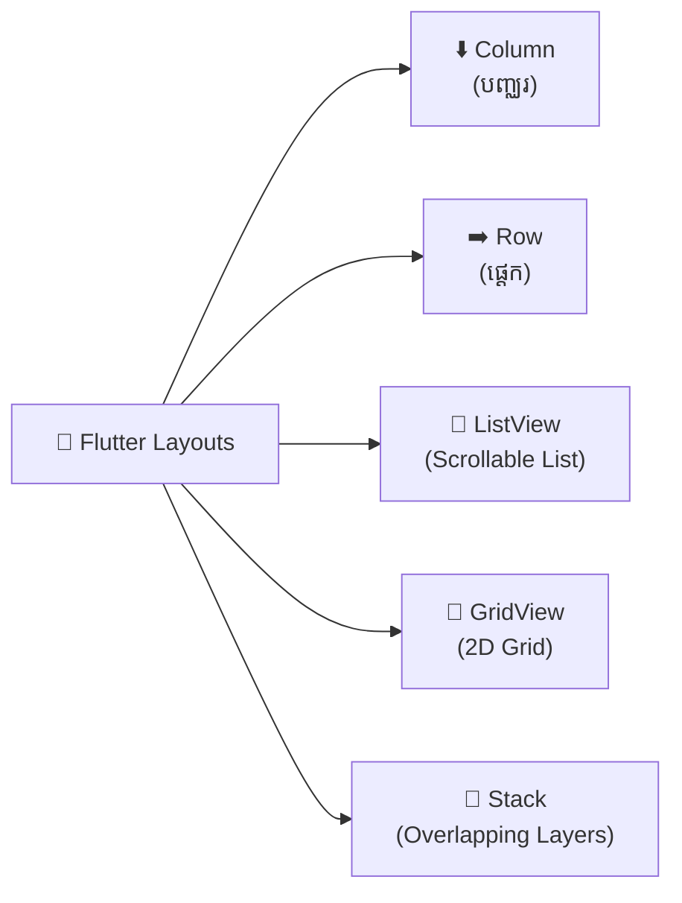
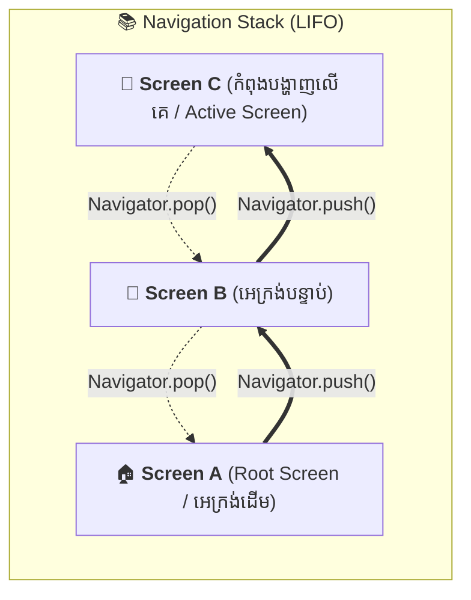

# 📘 មេរៀន និងលំហាត់អនុវត្ត សប្តាហ៍ទី ២ (Week 2)

## ប្រធានបទ៖ Flutter Layouts & Navigation

ឯកសារនេះត្រូវបានរៀបចំឡើងជាភាសាខ្មែរ សម្រាប់ជាជំនួយដល់ការសិក្សា រំលឹក និងអនុវត្តកូដ Flutter អំពីការរៀបចំ Layout (Column, Row, ListView, GridView, Stack) និងការគ្រប់គ្រងផ្ទាំងអេក្រង់ (Navigator)។

---

# 📌 ចំណុចទី ១ (Point 1): Flutter Layout Widgets

Layout Widgets គឺជា Widget សម្រាប់គ្រប់គ្រងទីតាំង ទំហំ និងការរៀបចំរបស់ Widget កូនៗ (Children Widgets) នៅលើអេក្រង់។

### 📊 តារាងសង្ខេប Layout Widgets (Visual Overview):

| Layout Widget          |   ទិសដៅ (Direction)   | ទម្រង់រៀបចំ (Visual Structure)                              | ការប្រើប្រាស់ចម្បង (Main Use Case)                             |
| :--------------------- | :-------------------------: | :--------------------------------------------------------------------- | :------------------------------------------------------------------------------- |
| **`Column`**   |       ⬇️ បញ្ឈរ       | `[ Element A ][ Element B ]``[ Element C ]`                        | រៀបចំធាតុពីលើចុះក្រោម (Forms, Profile Info)                 |
| **`Row`**      |       ➡️ ផ្ដេក       | `[ A ] [ B ] [ C ]`                                                  | រៀបចំធាតុពីឆ្វេងទៅស្ដាំ (Toolbars, Action Icons)          |
| **`ListView`** |   📜 រមូរចុះឡើង   | `[ Item 1 ][ Item 2 ]``[ Item 3 ]...`                              | បញ្ជីទិន្នន័យច្រើន ឬទាញពី API ដែលអាច Scroll បាន |
| **`GridView`** | 🔲 ក្រឡាចត្រង្គ | `[ A ] [ B ][ C ] [ D ]`                                             | បង្ហាញទំនិញ e-Commerce, Photo Gallery (២+ ជួរ)                    |
| **`Stack`**    |  🥞 ត្រួតលើគ្នា  | `Layer 3 (Badge)└── Layer 2 (Text)``    └── Layer 1 (Image)` | ដាក់ Widget ជាន់ពីលើគ្នា (Floating Badges, Overlays)             |



---

### 1. Column (ការរៀបចំ Widget តាមជួរឈរ / បញ្ឈរ)

`Column` ប្រើសម្រាប់ផ្ទុក Widget កូនៗជាច្រើន (`children`) តម្រៀបចុះក្រោមពីលើទៅក្រោម (Vertical direction)។

#### 🔹 លក្ខណៈពិសេសសំខាន់ៗ (Key Properties):

- `mainAxisAlignment`: តម្រឹម Widget តាមអ័ក្សចម្បង (បញ្ឈរ - Y Axis)
  - `MainAxisAlignment.start`: នៅលើគេបង្អស់ (Default)
  - `MainAxisAlignment.center`: នៅចំកណ្តាលបញ្ឈរ
  - `MainAxisAlignment.end`: នៅខាងក្រោមបង្អស់
  - `MainAxisAlignment.spaceBetween`: ចែកចន្លោះស្មើគ្នារវាង Item នីមួយៗ
  - `MainAxisAlignment.spaceAround`: ចែកចន្លោះជុំវិញ Item នីមួយៗ
  - `MainAxisAlignment.spaceEvenly`: ចែកចន្លោះស្មើៗគ្នាគ្រប់ទីតាំង
- `crossAxisAlignment`: តម្រឹម Widget តាមអ័ក្សកាត់ (ផ្ដេក - X Axis)
  - `CrossAxisAlignment.start`: ផ្អោបទៅឆ្វេង
  - `CrossAxisAlignment.center`: នៅកណ្តាលផ្ដេក (Default)
  - `CrossAxisAlignment.end`: ផ្អោបទៅស្ដាំ
  - `CrossAxisAlignment.stretch`: ពង្រីកទទឹងឱ្យពេញអេក្រង់
- `mainAxisSize`: កំណត់ទំហំកម្ពស់របស់ Column (`MainAxisSize.max` ឬ `MainAxisSize.min`)

#### 💻 គំរូកូដ (Code Example):

```dart
Column(
  mainAxisAlignment: MainAxisAlignment.center,
  crossAxisAlignment: CrossAxisAlignment.center,
  children: [
    Icon(Icons.star, size: 50, color: Colors.amber),
    SizedBox(height: 10),
    Text(
      'សូមស្វាគមន៍មកកាន់ Flutter',
      style: TextStyle(fontSize: 20, fontWeight: FontWeight.bold),
    ),
    SizedBox(height: 8),
    Text('រៀនបង្កើត Layout ជាមួយ Column'),
  ],
)
```

> [!WARNING]
> **ការការពារ Overflow:** ប្រសិនបើធាតុនៅក្នុង `Column` មានច្រើនហួសកម្ពស់អេក្រង់ វានឹងចេញកំហុសឆ្នូតលឿងខ្មៅ `RenderFlex overflowed by ... pixels`។ ដើម្បីដោះស្រាយ សូមរុំ `Column` ជាមួយ `SingleChildScrollView`។

---

### 2. Row (ការរៀបចំ Widget តាមជួរដេក / ផ្ដេក)

`Row` ប្រើសម្រាប់ផ្ទុក Widget កូនៗជាច្រើន (`children`) តម្រៀបតាមជួរដេកពីឆ្វេងទៅស្ដាំ (Horizontal direction)។

#### 🔹 លក្ខណៈពិសេសសំខាន់ៗ (Key Properties):

- `mainAxisAlignment`: តម្រឹមតាមអ័ក្សចម្បង (ផ្ដេក - X Axis) ដូចជា `start`, `center`, `spaceBetween`, `spaceAround`, `spaceEvenly`
- `crossAxisAlignment`: តម្រឹមតាមអ័ក្សកាត់ (បញ្ឈរ - Y Axis) ដូចជា `start`, `center`, `end`, `stretch`

#### 💻 គំរូកូដ (Code Example):

```dart
Row(
  mainAxisAlignment: MainAxisAlignment.spaceBetween,
  children: [
    Row(
      children: [
        CircleAvatar(
          backgroundImage: NetworkImage('https://picsum.photos/100'),
        ),
        SizedBox(width: 12),
        Column(
          crossAxisAlignment: CrossAxisAlignment.start,
          children: [
            Text('Pheasak', style: TextStyle(fontWeight: FontWeight.bold)),
            Text('Flutter Developer', style: TextStyle(color: Colors.grey)),
          ],
        ),
      ],
    ),
    IconButton(
      icon: Icon(Icons.more_vert),
      onPressed: () {},
    ),
  ],
)
```

> [!TIP]
> **ការប្រើប្រាស់ `Expanded` និង `Flexible`:** នៅពេលមាន `Text` វែង ឬ Widget ដែលអាចរីកធំនៅក្នុង `Row` ត្រូវរុំវាជាមួយ `Expanded` ដើម្បីកុំឱ្យកើតបញ្ហា Overflow លើអេក្រង់។

---

### 3. ListView (ការបង្កើតបញ្ជីរមូរចុះឡើង - Scrollable List)

`ListView` គឺជា Widget ដ៏ពេញនិយមសម្រាប់បង្ហាញបញ្ជីទិន្នន័យច្រើន ដែលអាចអូសចុះឡើង (Scroll) បានដោយស្វ័យប្រវត្តិ។

#### 🔹 ប្រភេទនៃការប្រើប្រាស់ `ListView`:

1. **`ListView(children: [...])`**: ប្រើសម្រាប់បញ្ជីតូចៗដែលមានចំនួនធាតុតិច និងកំណត់ជាមុនស្រេច។
2. **`ListView.builder(...)`**: ប្រើសម្រាប់ទិន្នន័យច្រើន ឬទិន្នន័យ Dynamic (ផ្ទុកតែ Item ណាដែលកំពុងបង្ហាញលើអេក្រង់ - Lazy Loading សន្សំសំចៃ Memory)។
3. **`ListView.separated(...)`**: ដូច `ListView.builder` ដែរ ប៉ុន្តែមានបន្ថែម `separatorBuilder` សម្រាប់ដាក់បន្ទាត់ខណ្ឌ (`Divider`) ចន្លោះ Item នីមួយៗ។

#### 💻 គំរូកូដ (Code Example - ListView.builder & separated):

```dart
// ឧទាហរណ៍ ListView.separated
final List<String> categories = ['ទូរស័ព្ទ', 'កុំព្យូទ័រ', 'នាឡិកា', 'កាសស្ដាប់', 'គ្រឿងបន្លាស់'];

ListView.separated(
  itemCount: categories.length,
  separatorBuilder: (context, index) => Divider(height: 1),
  itemBuilder: (context, index) {
    return ListTile(
      leading: CircleAvatar(
        backgroundColor: Colors.blue.shade100,
        child: Text('${index + 1}'),
      ),
      title: Text(categories[index]),
      subtitle: Text('ប្រភេទទី ${index + 1}'),
      trailing: Icon(Icons.arrow_forward_ios, size: 16),
      onTap: () {
        print('បានចុចលើ: ${categories[index]}');
      },
    );
  },
)
```

---

### 4. GridView (ការរៀបចំ Layout ជាក្រឡាចត្រង្គ - Grid System)

`GridView` ប្រើសម្រាប់រៀបចំ Widget ជាជួរដេក និងជួរឈរ (២ ឬច្រើនជួរឈរ) ដូចជាទំព័របង្ហាញផលិតផល កាតាឡុក ឬ Gallery រូបថត។

#### 🔹 លក្ខណៈពិសេសសំខាន់ៗ (Key Properties):

- `crossAxisCount`: ចំនួនជួរឈរ (Columns)
- `mainAxisSpacing`: គម្លាតរវាងជួរដេក (បញ្ឈរ)
- `crossAxisSpacing`: គម្លាតរវាងជួរឈរ (ផ្ដេក)
- `childAspectRatio`: សមាមាត្រទំហំកាត `(ទទឹង / កម្ពស់)` (ឧទាហរណ៍: `0.75` ឬ `1.0` សម្រាប់រាងការ៉េ)

#### 💻 គំរូកូដ (Code Example - GridView.builder):

```dart
GridView.builder(
  padding: EdgeInsets.all(12),
  gridDelegate: SliverGridDelegateWithFixedCrossAxisCount(
    crossAxisCount: 2,          // ចំនួន ២ ជួរឈរ
    crossAxisSpacing: 10,       // គម្លាតផ្ដេក 10px
    mainAxisSpacing: 10,        // គម្លាតបញ្ឈរ 10px
    childAspectRatio: 0.8,      // សមាមាត្រទំហំ
  ),
  itemCount: 6,
  itemBuilder: (context, index) {
    return Card(
      elevation: 3,
      shape: RoundedRectangleBorder(borderRadius: BorderRadius.circular(12)),
      child: Column(
        crossAxisAlignment: CrossAxisAlignment.start,
        children: [
          Expanded(
            child: Container(
              decoration: BoxDecoration(
                color: Colors.blueGrey.shade100,
                borderRadius: BorderRadius.vertical(top: Radius.circular(12)),
              ),
              child: Center(
                child: Icon(Icons.shopping_bag, size: 50, color: Colors.blue),
              ),
            ),
          ),
          Padding(
            padding: EdgeInsets.all(8.0),
            child: Column(
              crossAxisAlignment: CrossAxisAlignment.start,
              children: [
                Text('ទំនិញទី ${index + 1}', style: TextStyle(fontWeight: FontWeight.bold)),
                SizedBox(height: 4),
                Text('\$${(index + 1) * 25}.00', style: TextStyle(color: Colors.green)),
              ],
            ),
          ),
        ],
      ),
    );
  },
)
```

---

### 5. Stack (ការដាក់ Widget ត្រួតលើគ្នា - Overlapping Layout)

`Stack` ប្រើសម្រាប់ដាក់ Widget ជាច្រើនត្រួតពីលើគ្នាជាស្រទាប់ៗ (Layers) ដូចជាការដាក់ Badge សារលើរូបភាព ឬប៊ូតុងអណ្តែតលើផ្ទាំង Background។

- Widget ណាដែលនៅខាងក្រោមគេក្នុង `children: [...]` នឹងស្ថិតនៅ **ស្រទាប់បាតក្រោមគេ**។
- Widget ណាដែលនៅខាងចុងគេក្នុង `children: [...]` នឹងស្ថិតនៅ **ស្រទាប់លើគេបង្អស់**។

#### 🔹 Widget ជំនួយដែលនិយមប្រើជាមួយ Stack:

- `Positioned`: ប្រើសម្រាប់កំណត់ទីតាំងជាក់លាក់ (`top`, `bottom`, `left`, `right`, `width`, `height`)
- `Align`: ប្រើសម្រាប់តម្រឹមទីតាំង (`Alignment.topRight`, `Alignment.bottomCenter`, etc.)

#### 💻 គំរូកូដ (Code Example):

```dart
Stack(
  clipBehavior: Clip.none,
  children: [
    // ស្រទាប់ទី ១: កាតរូបភាព
    Container(
      width: 200,
      height: 120,
      decoration: BoxDecoration(
        color: Colors.indigo,
        borderRadius: BorderRadius.circular(16),
      ),
      child: Center(
        child: Text(
          'កាតប្រូម៉ូសិន',
          style: TextStyle(color: Colors.white, fontSize: 18, fontWeight: FontWeight.bold),
        ),
      ),
    ),
  
    // ស្រទាប់ទី ២: Badge បញ្ចុះតម្លៃនៅជ្រុងខាងស្ដាំលើ
    Positioned(
      top: 8,
      right: 8,
      child: Container(
        padding: EdgeInsets.symmetric(horizontal: 8, vertical: 4),
        decoration: BoxDecoration(
          color: Colors.red,
          borderRadius: BorderRadius.circular(12),
        ),
        child: Text(
          '-30% OFF',
          style: TextStyle(color: Colors.white, fontSize: 12, fontWeight: FontWeight.bold),
        ),
      ),
    ),

    // ស្រទាប់ទី ៣: Icon Favorite នៅជ្រុងខាងឆ្វេងក្រោម
    Positioned(
      bottom: 8,
      left: 8,
      child: CircleAvatar(
        radius: 16,
        backgroundColor: Colors.white.withOpacity(0.9),
        child: Icon(Icons.favorite, color: Colors.red, size: 18),
      ),
    ),
  ],
)
```

---

# 📌 ចំណុចទី ២ (Point 2): Flutter Navigator & Routes

`Navigator` គឺជាប្រព័ន្ធគ្រប់គ្រងការធ្វើដំណើរផ្លាស់ប្តូរអេក្រង់ (Screen Navigation) នៅក្នុង Flutter ដោយដំណើរការលើគោលការណ៍ **Stack (LIFO: Last In, First Out - ចូលក្រោយគេ ចេញមុនគេ)**។



| Action                             | មុខងារ (Function)                                                         | ឧទាហរណ៍ជាក់ស្តែង (Use Case)                        |
| :--------------------------------- | :------------------------------------------------------------------------------ | :----------------------------------------------------------------- |
| **`push()`**               | បន្ថែម Screen ថ្មីទៅលើគេបង្អស់នៃ Stack                  | ចុចលើផលិតផល ដើម្បីបើកមើល Details            |
| **`pop()`**                | ដក Screen ខាងលើគេចេញ ដើម្បីត្រឡប់ថយក្រោយ         | ចុចប៊ូតុង Back ឬ Done ដើម្បីត្រឡប់មកវិញ |
| **`pushReplacement()`**    | ប្តូរទំព័រថ្មី ហើយលុបទំព័របច្ចុប្បន្នចោល | ពី Splash Screen ទៅ Home Screen                                |
| **`pushAndRemoveUntil()`** | បើកទំព័រថ្មី ហើយលុប Route ចាស់ៗទាំងអស់            | ពេល User ចុច Logout ត្រឡប់ទៅ Login Screen            |

---

### 1. ការបើកទំព័រថ្មី និងការថយក្រោយ (Basic Push & Pop)

#### 🔹 `Navigator.push()`: បន្ថែមអេក្រង់ថ្មីទៅលើគេបង្អស់នៃ Stack

```dart
Navigator.push(
  context,
  MaterialPageRoute(
    builder: (context) => DetailScreen(),
  ),
);
```

#### 🔹 `Navigator.pop()`: បិទអេក្រង់បច្ចុប្បន្ន ដើម្បីត្រឡប់ទៅអេក្រង់មុន

```dart
Navigator.pop(context);
```

---

### 2. ការបញ្ជូន និងទទួលទិន្នន័យរវាង Screen (Passing & Returning Data)

#### 🔹 របៀបទី ១៖ បញ្ជូនទិន្នន័យទៅកាន់អេក្រង់ថ្មី (តាម Constructor)

```dart
// នៅលើទំព័រដើម (HomeScreen)
Navigator.push(
  context,
  MaterialPageRoute(
    builder: (context) => ProductDetailScreen(
      productTitle: 'MacBook Pro M3',
      price: 1999.99,
    ),
  ),
);

// នៅលើទំព័រទទួល (ProductDetailScreen)
class ProductDetailScreen extends StatelessWidget {
  final String productTitle;
  final double price;

  const ProductDetailScreen({
    Key? key,
    required this.productTitle,
    required this.price,
  }) : super(key: key);

  @override
  Widget build(BuildContext context) {
    return Scaffold(
      appBar: AppBar(title: Text(productTitle)),
      body: Center(
        child: Text('តម្លៃ: \$$price'),
      ),
    );
  }
}
```

#### 🔹 របៀបទី ២៖ ទទួលទិន្នន័យត្រឡប់មកវិញ (Return Data with Pop)

```dart
// ១. នៅលើទំព័រដើម: ប្រើ await ដើម្បីរង់ចាំទិន្នន័យត្រឡប់មកវិញ
final result = await Navigator.push(
  context,
  MaterialPageRoute(builder: (context) => SelectionScreen()),
);

if (result != null) {
  ScaffoldMessenger.of(context).showSnackBar(
    SnackBar(content: Text('អ្នកបានជ្រើសរើស: $result')),
  );
}

// ២. នៅលើទំព័រជ្រើសរើស (SelectionScreen): បញ្ជូនទិន្នន័យពេល Pop
ElevatedButton(
  onPressed: () {
    Navigator.pop(context, 'ជម្រើសទី ១'); // បញ្ជូន 'ជម្រើសទី ១' ត្រឡប់ទៅវិញ
  },
  child: Text('យល់ព្រម'),
)
```

---

### 3. ការផ្លាស់ប្តូរ Screen កម្រិតខ្ពស់ (Replacement & Remove Until)

- **`Navigator.pushReplacement()`**: បើកទំព័រថ្មី ហើយលុបទំព័របច្ចុប្បន្នចោល (មិនអាចចុចថយក្រោយមកវិញបានទេ)។

  - *ស័ក្តិសមសម្រាប់:* SplashScreen ទៅ HomeScreen ឬ LoginScreen ទៅ HomeScreen។

  ```dart
  Navigator.pushReplacement(
    context,
    MaterialPageRoute(builder: (context) => HomeScreen()),
  );
  ```
- **`Navigator.pushAndRemoveUntil()`**: បើកទំព័រថ្មី ហើយសម្អាត Stack ចាស់ៗទាំងអស់ចេញ។

  - *ស័ក្តិសមសម្រាប់:* ការចុច Logout ត្រឡប់ទៅ LoginScreen វិញ។

  ```dart
  Navigator.pushAndRemoveUntil(
    context,
    MaterialPageRoute(builder: (context) => LoginScreen()),
    (route) => false, // លុប Routes ទាំងអស់ចេញ
  );
  ```

---

### 4. ការប្រើប្រាស់ Named Routes (ឈ្មោះ Route)

ការកំណត់ Route ជាឈ្មោះជួយឱ្យកូដមានរបៀបរៀបរយ និងងាយស្រួលគ្រប់គ្រងក្នុង Project ធំៗ។

```dart
// នៅក្នុង main.dart (MaterialApp)
MaterialApp(
  initialRoute: '/',
  routes: {
    '/': (context) => HomeScreen(),
    '/detail': (context) => DetailScreen(),
    '/profile': (context) => ProfileScreen(),
  },
);

// ការហៅប្រើ Named Route
Navigator.pushNamed(context, '/detail');
```

---

# 📝 លំហាត់អនុវត្តជាក់ស្តែង (Practice Exercises)

---

### 📌 លំហាត់ទី ១: សាងសង់ទំព័រផលិតផល e-Commerce (Layout Master Focus)

**គំរូលទ្ធផលរំពឹងទុក (Expected UI Result):**


**តម្រូវការ:**

1. បង្កើតអេក្រង់ `ProductCatalogScreen` ដែលមាន៖
   - ផ្នែកខាងលើ (`Row` + `Column`): បង្ហាញ Header ស្វាគមន៍ (`"Welcome back!"`) និងរូប Profile
   - ផ្នែកកណ្តាល (`ListView` ផ្ដេក `Axis.horizontal`): បង្ហាញបញ្ជីប្រភេទផលិតផល (Categories: All, Phones, Laptops, Watches, Headphones) ដោយមានប៊ូតុងមួយកំពុង Active (ពណ៌ខៀវ)
   - ផ្នែកខាងក្រោម (`GridView.builder`): បង្ហាញបញ្ជីផលិតផលជា ២ ជួរឈរ
2. នៅលើកាតទំនិញនីមួយៗក្នុង GridView ត្រូវប្រើ `Stack`:
   - ដាក់រូបភាពទំនិញ
   - ប្រើ `Positioned` ដាក់ Badge បញ្ចុះតម្លៃ `"-20%"` ពណ៌ក្រហមនៅជ្រុងខាងស្ដាំលើ
   - ប្រើ `Positioned` ដាក់ `IconButton` រូបបេះដូង (Favorite) នៅជ្រុងខាងឆ្វេងលើ

---

### 📌 លំហាត់ទី ២: បង្កើតលំហូរ Navigation និងបញ្ជូនទិន្នន័យ (Navigation Flow Focus)

**គំរូលទ្ធផលរំពឹងទុក (Expected UI Result):**


**តម្រូវការ:**

1. នៅពេល User ចុចលើកាតទំនិញណាមួយនៅក្នុង `ProductCatalogScreen` (លំហាត់ទី ១):
   - ប្រើ `Navigator.push` ដើម្បីបើកទៅកាន់ `ProductDetailScreen`
   - បញ្ជូនព័ត៌មានទំនិញ (`name`, `price`, `imageUrl`, `description`, `rating`) ទៅកាន់ `ProductDetailScreen` តាមរយៈ Constructor
2. នៅលើ `ProductDetailScreen`:
   - មាន `AppBar` ជាមួយប៊ូតុងថយក្រោយ (Back Button) និងប៊ូតុង Favorite
   - បង្ហាញរូបភាពធំនៅចំកណ្តាល និងព័ត៌មានលម្អិតនៃទំនិញ (Title, Price, Rating, Description)
   - មានប៊ូតុង `"Buy Now"` ពេញទទឹងនៅផ្នែកខាងក្រោម
   - ពេលចុចប៊ូតុង Buy Now ត្រូវហៅ `Navigator.pop(context, "បានបញ្ជាទិញ ${widget.name} ជោគជ័យ!")`
3. នៅពេលត្រឡប់មកអេក្រង់ដើមវិញ ត្រូវចាប់យកសារត្រឡប់នោះ ហើយបង្ហាញ `SnackBar` ពណ៌បៃតងជូនដំណឹងដល់ User។

---

## 🔍 សំណួរពិភាក្សា និងការរំលឹកសាកល្បង (Quiz / Discussion)

1. **តើ `Column` និង `ListView` មានលក្ខណៈខុសគ្នាយ៉ាងដូចម្តេច? ហើយតើពេលណាដែលយើងគួរជ្រើសរើសប្រើមួយណា?**
2. **ហេតុអ្វីបានជាគេណែនាំឱ្យប្រើ `ListView.builder` ឬ `GridView.builder` ជំនួសឱ្យ `ListView` ឬ `GridView` ធម្មតានៅពេលមានទិន្នន័យច្រើន?**
3. **តើ `MainAxisAlignment` និង `CrossAxisAlignment` មានដំណើរការខុសគ្នាយ៉ាងដូចម្តេចរវាង `Row` និង `Column`?**
4. **តើ `Navigator.push` និង `Navigator.pushReplacement` ខុសគ្នាយ៉ាងដូចម្តេច? សូមលើកឧទាហរណ៍ជាក់ស្តែងក្នុងការប្រើប្រាស់។**
5. **នៅក្នុង `Stack` ប្រសិនបើយើងចង់កំណត់ទីតាំង Widget កូនឱ្យនៅជ្រុងខាងស្ដាំបាតក្រោម តើយើងត្រូវប្រើប្រាស់ Widget អ្វី និងកំណត់ Properties ដូចម្តេច?**
