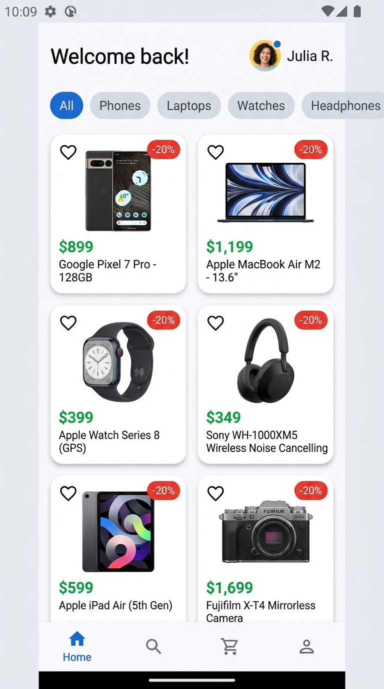

# 📝 លំហាត់អនុវត្តជាក់ស្តែង (Practice Exercises)

---

### 📌 លំហាត់ទី ១: សាងសង់ទំព័រផលិតផល e-Commerce (Layout Master Focus)

**គំរូលទ្ធផលរំពឹងទុក (Expected UI Result):**

**តម្រូវការ:**

1. បង្កើតអេក្រង់ `ProductCatalogScreen` ដែលមាន៖
   - ផ្នែកខាងលើ (`Row` + `Column`): បង្ហាញ Header ស្វាគមន៍ (`"Welcome back!"`) និងរូប Profile
   - ផ្នែកកណ្តាល (`ListView` ផ្ដេក `Axis.horizontal`): បង្ហាញបញ្ជីប្រភេទផលិតផល (Categories: All, Phones, Laptops, Watches, Headphones) ដោយមានប៊ូតុងមួយកំពុង Active (ពណ៌ខៀវ)
   - ផ្នែកខាងក្រោម (`GridView.builder`): បង្ហាញបញ្ជីផលិតផលជា ២ ជួរឈរ
2. នៅលើកាតទំនិញនីមួយៗក្នុង GridView ត្រូវប្រើ `Stack`:
   - ដាក់រូបភាពទំនិញ
   - ប្រើ `Positioned` ដាក់ Badge បញ្ចុះតម្លៃ `"-20%"` ពណ៌ក្រហមនៅជ្រុងខាងស្ដាំលើ
   - ប្រើ `Positioned` ដាក់ `IconButton` រូបបេះដូង (Favorite) នៅជ្រុងខាងឆ្វេងលើ

---

### 📌 លំហាត់ទី ២: បង្កើតលំហូរ Navigation និងបញ្ជូនទិន្នន័យ (Navigation Flow Focus)

**គំរូលទ្ធផលរំពឹងទុក (Expected UI Result):**

**តម្រូវការ:**

1. នៅពេល User ចុចលើកាតទំនិញណាមួយនៅក្នុង `ProductCatalogScreen` (លំហាត់ទី ១):
   - ប្រើ `Navigator.push` ដើម្បីបើកទៅកាន់ `ProductDetailScreen`
   - បញ្ជូនព័ត៌មានទំនិញ (`name`, `price`, `imageUrl`, `description`, `rating`) ទៅកាន់ `ProductDetailScreen` តាមរយៈ Constructor
2. នៅលើ `ProductDetailScreen`:
   - មាន `AppBar` ជាមួយប៊ូតុងថយក្រោយ (Back Button) និងប៊ូតុង Favorite
   - បង្ហាញរូបភាពធំនៅចំកណ្តាល និងព័ត៌មានលម្អិតនៃទំនិញ (Title, Price, Rating, Description)
   - មានប៊ូតុង `"Buy Now"` ពេញទទឹងនៅផ្នែកខាងក្រោម
   - ពេលចុចប៊ូតុង Buy Now ត្រូវហៅ `Navigator.pop(context, "បានបញ្ជាទិញ ${widget.name} ជោគជ័យ!")`
3. នៅពេលត្រឡប់មកអេក្រង់ដើមវិញ ត្រូវចាប់យកសារត្រឡប់នោះ ហើយបង្ហាញ `SnackBar` ពណ៌បៃតងជូនដំណឹងដល់ User។

---

## 🔍 សំណួរពិភាក្សា និងការរំលឹកសាកល្បង (Quiz / Discussion)

1. **តើ `Column` និង `ListView` មានលក្ខណៈខុសគ្នាយ៉ាងដូចម្តេច? ហើយតើពេលណាដែលយើងគួរជ្រើសរើសប្រើមួយណា?**
2. **ហេតុអ្វីបានជាគេណែនាំឱ្យប្រើ `ListView.builder` ឬ `GridView.builder` ជំនួសឱ្យ `ListView` ឬ `GridView` ធម្មតានៅពេលមានទិន្នន័យច្រើន?**
3. **តើ `MainAxisAlignment` និង `CrossAxisAlignment` មានដំណើរការខុសគ្នាយ៉ាងដូចម្តេចរវាង `Row` និង `Column`?**
4. **តើ `Navigator.push` និង `Navigator.pushReplacement` ខុសគ្នាយ៉ាងដូចម្តេច? សូមលើកឧទាហរណ៍ជាក់ស្តែងក្នុងការប្រើប្រាស់។**
5. **នៅក្នុង `Stack` ប្រសិនបើយើងចង់កំណត់ទីតាំង Widget កូនឱ្យនៅជ្រុងខាងស្ដាំបាតក្រោម តើយើងត្រូវប្រើប្រាស់ Widget អ្វី និងកំណត់ Properties ដូចម្តេច?**
