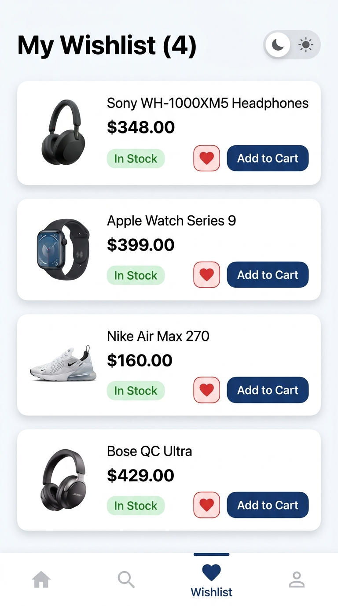

# 📝 លំហាត់អនុវត្តជាក់ស្តែង (Practice Exercises)

---

### 📌 លំហាត់ : Wishlist & Dark/Light Mode Theme Switcher (GetX App State)

**គំរូលទ្ធផលរំពឹងទុក (Expected UI Result):**

**តម្រូវការអនុវត្ត:**
1. **Theme Mode State (Dark / Light Theme)**៖
   - បង្កើត `ThemeController` មាន `var isDarkMode = false.obs;`
   - បង្កើត Switch នៅលើ AppBar: ពេល Toggle ត្រូវហៅ `Get.changeThemeMode(...)` ដើម្បីប្តូរពណ៌ផ្ទៃ App ភ្លាមៗ (Dark $\leftrightarrow$ Light)
2. **Wishlist / Favorite State (GetX Controller)**៖
   - បង្កើត `WishlistController` គ្រប់គ្រងបញ្ជីទំនិញដែលបាន Like (`var wishlist = <Product>[].obs;`)
   - មាន Icon បេះដូងក្រហម (`Icons.favorite`): ពេលចុចលើបេះដូង $\rightarrow$ ដកចេញពី Wishlist ភ្លាមៗ
   - ប៊ូតុង `"Add to Cart"`: ចុចហើយហៅ `Get.find<CartController>().addToCart(product)` ដើម្បីបញ្ជូនទំនិញទៅ Shopping Cart ដោយស្វ័យប្រវត្តិ

---

## 🔍 សំណួរពិភាក្សា និងការរំលឹកសាកល្បង (Quiz / Discussion)

1. **តើអ្វីជាភាពខុសគ្នារវាង Ephemeral State (Local State) និង App State (Global State)? សូមលើកឧទាហរណ៍ជាក់ស្តែង ៣ សម្រាប់ State នីមួយៗ។**
2. **ហេតុអ្វីបានជា GetX ត្រូវបានគេនិយមប្រើប្រាស់យ៉ាងច្រើនសម្រាប់ការគ្រប់គ្រង App State? តើវាមានគុណសម្បត្តិអ្វីខ្លះធៀបនឹង State Management ផ្សេងទៀត?**
3. **តើ `.obs` និង `Obx()` នៅក្នុង GetX មានទំនាក់ទំនង និងដំណើរការរួមគ្នាយ៉ាងដូចម្តេច?**
4. **តើ `Get.put()` និង `Get.find()` ខុសគ្នាយ៉ាងដូចម្តេច? តើយើងគួរប្រើវាក្នុងកាលៈទេសៈណា?**
5. **នៅក្នុង GetX ហេតុអ្វីបានជាយើងមិនចាំបាច់ប្រើ `BuildContext` ដើម្បី update State ឬបើកផ្ទាំង Navigation?**

